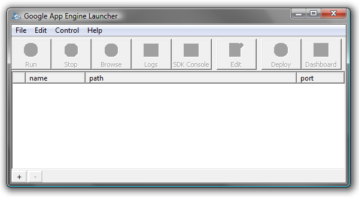
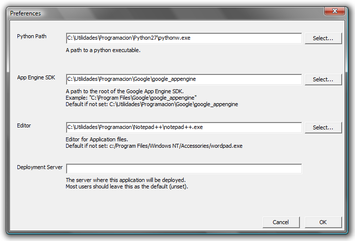
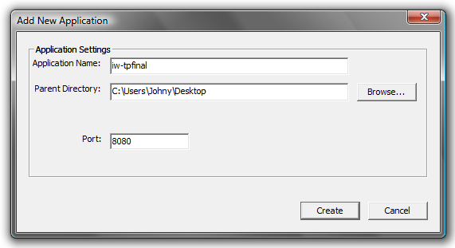
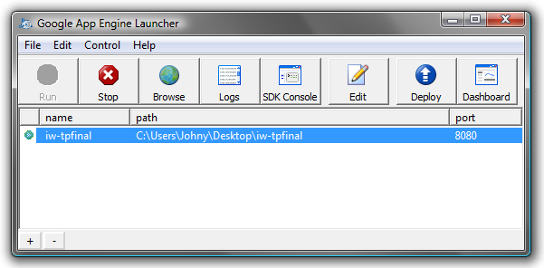
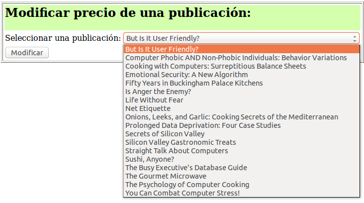
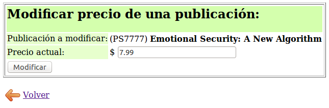
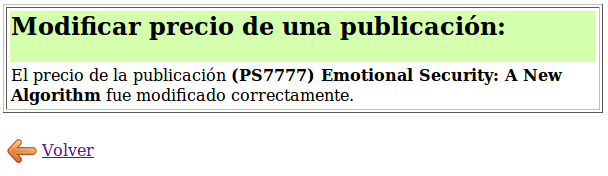

 
 
 
 
<h1 class="titulo">
Caso de Estudio usando el patrón MVC con Google App Engine y Python
</h1>
 
 
 
 
 

Trabajo final Ingeniería Web

2013

Juan Bertinetti

# Contenido

[TOC]

# 1. Introducción:

Al decidir un tema para este trabajo mi intención era mostrar alguna otra tecnología para hacer aplicaciones web que las enseñadas en clases (*Servlets Java*, *JSP*, *JavaBeans*, *JavaServer Faces*, etc.). Me llamó la atención ***Google App Engine***, un servicio de alojamiento para aplicaciones web que nos ofrece Google de forma gratuita, ya que nos permite desarrollar nuestras aplicaciones en **Python** y dejarlas disponibles en la Web con muchísima facilidad y usando toda la infraestructura de Google, por lo que decidí introducirme en el tema y tratar de llevar lo aprendido en clases a esta plataforma.

Google App Engine nos permite desarrollar nuestras aplicaciones web en Java o en Python, y más recientemente en Go (el lenguaje de programación de Google) y en PHP. En este trabajo decidí optar por Python para mostrar una alternativa al desarrollo de aplicaciones web (donde generalmente las tecnologías más comunes son Java, PHP, ASP/ASP.NET, etc.), y lo sencillo que es trabajar usando este lenguaje y este servicio.

Por lo tanto este trabajo tiene como objetivo presentar Google App Engine y la manera en que podemos desarrollar aplicaciones web para esta plataforma. Más específicamente, mostrar un caso de estudio implementado usando estas herramientas, en donde teniendo una base de datos con publicaciones guardadas, podemos modificar el precio de una publicación a elección, aplicando el patrón MVC (Modelo-Vista-Controlador).

Cuando sea posible voy a mostrar las equivalencias con la API de Servlets Java aprendida en clases.

# 2. Instalación del entorno:

## 2.1 Conseguir las herramientas:

Para desarrollar aplicaciones para Google App Engine debemos descargarnos el kit de desarrollo (SDK) el cual es gratuito y libre. En este momento la última versión es la **1.8.2**.

Podemos descargarlo de la siguiente página:

<https://developers.google.com/appengine/downloads?hl=es-AR>

en la cual disponemos de varias opciones según nuestras preferencias:

* el SDK para Python (que incluye una versión para Windows, para Mac OS X, y para Linux y otras plataformas)
* el SDK para Java
* el SDK para Go y una versión experimental del SDK para PHP

En este trabajo haremos uso de la primera opción (SDK para Python), por lo tanto descargamos el archivo **google_appengine_1.8.2.zip** (pesa alrededor de unos 50 MB) si estamos en Linux o el instalador **GoogleAppEngine-1.8.2.msi** (unos 40 MB) si estamos en Windows.

También necesitamos el intérprete de Python. Se puede conseguir en su sitio oficial ([www.python.org](http://www.python.org)) o desde los repositorios de la distribución de Linux que usemos. Necesitamos la versión 2 y no la 3, ya que App Engine está diseñado para trabajar con la versión 2 de Python (recomiendan la 2.7).

Para escribir nuestras aplicaciones podemos hacer uso de cualquier editor de programación de nuestra preferencia, no hace falta disponer de ningún IDE especial. Sin embargo, se encuentra disponible un plugin[^plugin] que integra el SDK (para Java) con Eclipse.

[^plugin]: <https://developers.google.com/eclipse/?hl=es-AR>

## 2.2 Instalación:

### 2.2.1 Python:

Python viene instalado por defecto en muchas distribuciones Linux. Sino podemos instalarlo desde los repositorios (esto depende de la distribución). Por ejemplo:

    sudo apt-get install python

En Windows ejecutamos el instalador descargado (archivo .msi) y esperamos que nos instale todo automáticamente.

### 2.2.2 El kit de desarrollo:

Una vez descargado el SDK, la instalación es muy sencilla.

En Linux, solamente descomprimimos el archivo ZIP a alguna carpeta y ya estamos listos para trabajar (por ejemplo en la carpeta google_appengine).

En Windows, el archivo de instalación nos instala todo automáticamente. La versión para Windows incluye además un lanzador gráfico, que tenemos que configurar para poder trabajar:

Vamos a Edit/Preferences y configuramos los distintos elementos:

- En "Python Path" buscamos la ruta del ejecutable "pythonw.exe" en donde instalamos Python.
- En "App Engine SDK" ponemos la ruta de la carpeta donde instalamos el SDK de App Engine.
- En "Editor" ponemos algún editor de texto de nuestra preferencia.
- Dejamos en blanco "Deployment Server".

### 2.2.3 El servidor de pruebas:

El SDK trae un servidor de pruebas que emula todos los servicios de App Engine con el que podemos probar nuestras aplicaciones localmente y que no requiere ninguna configuración adicional para trabajar con él. Más adelante voy a mostrar cómo usarlo.

# 3. Pequeña guía sobre Google App Engine:

## 3.1 Qué es Google App Engine:

Google App Engine es una plataforma que permite alojar y ejecutar nuestras aplicaciones web en la infraestructura de Google, brindándonos una serie de servicios y herramientas para que sean fáciles de crear, de mantener y de ampliar al ir aumentando el tráfico y las necesidades de almacenamiento de datos.

App Engine puede empezar a usarse de forma totalmente gratuita, y luego pagar los recursos que utiliza nuestra aplicación (como almacenamiento y ancho de banda) que superen los niveles gratuitos. Todas las aplicaciones pueden utilizar sin costo alguno hasta 500 MB de almacenamiento y suficiente CPU y ancho de banda como para permitir un servicio eficaz de alrededor de cinco millones de visitas a la página al mes.

Algunos de los servicios que nos brinda son:

* Google Accounts:

App Engine permite que nuestra aplicación tenga autenticación de usuarios a través de Google Accounts, permitiéndolos acceder con su cuenta de Google.

* Extracción de URL:

Permite que las aplicaciones puedan acceder a recursos en Internet, mediante la infraestructura de alta velocidad de Google, y trabajar con ellos.

* Correo:

Nuestras aplicaciones pueden enviar mensajes de correo electrónico.

* Memcache:

Servicio de memoria caché de valores-claves de alto rendimiento, accesible desde varias instancias de nuestra aplicación.

* Manipulación de imágenes:

Este servicio permite a nuestra aplicación manipular imágenes, como recortar, girar, dar la vuelta o ajustar el tamaño. 

* Tareas programadas y colas de tareas:

Podemos configurar la programación de tareas para que nuestra aplicación ejecute, así como también ella misma puede añadir tareas a una cola.

Además de estos servicios, tenemos a disposición muchas herramientas y recursos útiles para trabajar en App Engine, que podemos consultar en su página[^tools].

Información más detallada sobre App Engine se puede ver en este enlace[^mas]. La página web de la plataforma es muy rica en documentación e información relacionada, incluyendo ejemplos, tutoriales, preguntas frecuentes, etc. Es recomendable darle un vistazo.

[^tools]: <https://developers.google.com/appengine/tools_tips?hl=es-AR>
[^mas]: <http://code.google.com/intl/es-AR/appengine/docs/whatisgoogleappengine.html>

## 3.2 Estructura de una aplicación web:

Una aplicación web creada para App Engine en Python consiste básicamente en uno o varios archivos *.py* (código fuente) ordenados a gusto en subdirectorios o no, y un archivo de configuración llamado `app.yaml` ubicado en la raíz y que es obligatorio. Sería el equivalente al archivo `web.xml` ubicado en el directorio **WEB-INF** que usamos en nuestras aplicaciones con servlets Java en el sentido de que es quien describe a nuestra aplicación y donde se configuran sus opciones de despliegue.
La sintaxis de este archivo es YAML[^yaml], y una configuración básica sería la siguiente:

    :::yaml
    application: nombre_de_la_aplicación
    version: 1
    runtime: python27
    api_version: 1
    threadsafe: yes
    
    handlers:
    - url: /.*
      script: modulo.application

En él se configura el nombre y versión de nuestra aplicación, runtime y versión de la API (siempre 1), y los *handlers*: todas las solicitudes enviadas a una URL cuya ruta coincida con la expresión **url** se deben procesar con el módulo indicado por **script** (en el ejemplo, `application` es el objeto que representa a la aplicación, declarado en `modulo.py`). En este caso, **/.\*** significa todas las URL's.

Con estos datos ya alcanza para tener nuestra aplicación funcionando. Es recomendable configurar que todas las URL's sean procesadas por un único módulo, y este módulo se encargará luego de redirigir cada petición a otro módulo específico.

[^yaml]: YAML Ain't Markup Language (www.yaml.org)

Si tenemos un directorio con archivos estáticos (es decir que puedan ser accedidos al invocarse su URL) debemos definir una nueva entrada en **handlers**:

    :::yaml
    handlers:
    - url: /img
      static_dir: img
    
    - url: /.*
      script: modulo.application

De esta forma en el ejemplo podemos acceder a cualquier archivo ubicado en la carpeta **img** a través de la URL **/img/nombre_del_archivo**.

>**Nota:** 
> Las últimas versiones del SDK de App Engine incluyen un directorio llamado **new_project_template** que contiene un esqueleto como el explicado anteriormente para empezar a desarrollar una nueva aplicación.

## 3.3 Uso de `webapp`:

Las aplicaciones Python de App Engine se comunican con el servidor web mediante el estándar CGI. Aunque el estándar CGI es sencillo, escribir manualmente todo el código que utiliza sería muy laborioso. Es por esto que App Engine permite el uso de frameworks creados enteramente en Python que usen CGI con el fin de esconder sus detalles y permitir a los programadores concentrarse en las funciones de su aplicación. Algunos frameworks que se pueden usar son Django, CherryPy, Pylons y web.py.

Sin embargo, App Engine ya incluye un framework sencillo que viene con el kit de desarrollo y que es muy fácil de usar, llamado **webapp**. En este trabajo voy a usar `webapp` para mantener las cosas simples.

Un ejemplo de aplicación web usando este framework es el siguiente (éste sería el archivo `modulo.py` que comentaba anteriormente cuando hablaba del archivo `app.yaml`):

    :::python
    from google.appengine.ext import webapp
    
    class MainPage(webapp.RequestHandler):
        def get(self):
            self.response.out.write('Hola mundo!')

    application = webapp.WSGIApplication([('/', MainPage)],
     							debug=True)

Podemos analizar lo siguiente:

* Nuestra aplicación consiste de un objeto `webapp.WSGIApplication` (la variable `application`, la que especificamos en el archivo `app.yaml`) que posee una lista de rutas y la clase que manejará cada ruta (en este ejemplo la raíz "/" será manejada por la clase `MainPage`).

* La clase manejadora (`MainPage`) es una clase que hereda de `webapp.RequestHandler`. Este tipo de clase sería el equivalente a la clase `HttpServlet` que usamos en Java, donde definimos el comportamiento para el método GET (en este caso con la función `get(self)`). Podemos también definir el comportamiento para el método POST con la función `post(self)`.

* La clase `webapp.RequestHandler` nos provee el objeto `self.response`, equivalente al `HttpServletResponse` que usamos en Java y que nos permite armar la respuesta a la solicitud. En este ejemplo simplemente escribimos "Hola Mundo!" en el objeto `self.response.out` equivalente al brindado por `HttpServletResponse.getWriter()` en Java.

Como vamos a ver en el caso de estudio, `webapp.RequestHandler` también nos provee el objeto `self.request` para obtener datos de la petición, equivalente al objeto `HttpServletRequest` que usamos en Java.

Con esto ya podemos tener una aplicación web sencilla corriendo en App Engine. Más adelante cuando desarrolle el caso de estudio, será necesario dar unas explicaciones sobre el almacén de datos usado por App Engine (una base de datos no relacional) y el sistema de plantillas, para poder implementar el patrón MVC.

> **Nota:** 
> Las últimas versiones del SDK de App Engine incluyen la versión 2 de `webapp`, que incluye varias mejoras y funcionalidades nuevas. En este trabajo por simplicidad usaré la versión 1.

## 3.4 El almacén de datos de App Engine:

### 3.4.1 Introducción:

El almacén de datos de App Engine es una base de datos de objetos sin esquema (no relacional) y distribuida, que dispone de un motor de consultas y transacciones atómicas, ofreciendo un almacenamiento sólido y escalable, con especial atención en el rendimiento de las consultas y de las operaciones de lectura.

En las últimas versiones de App Engine, la opción brindada para almacenar datos se llama **almacén de datos de replicación con alta disponibilidad** (o **HRD** por sus siglas en inglés, *High Replication Datastore*).

Este tipo de almacén ofrece una gran disponibilidad para las operaciones de lectura y de escritura, ya que los datos se replican en los centros de datos, y no existen períodos de inactividad programados. Como contrapartida, las operaciones de escritura tienen una mayor latencia, y la mayoría de las consultas son de **consistencia eventual**.

> **Nota:** 
> La otra opción brindada es el almacén de datos **maestro/esclavo** (o principal/secundario), donde sólo hay un centro de datos físico principal para las operaciones de escritura. Esto ofrece consistencia fuerte para todas las consultas y operaciones de lectura, pero como contrapartida, se producen períodos de inactividad temporales por incidencias en el centro de datos o por labores de mantenimiento planificadas. Sin embargo, está desfavorecido el uso de esta opción y recomiendan fuertemente usar (o migrar a) HRD. Además, usando el runtime de Python 2.7, esta opción no está disponible.

Desde el punto de vista de su uso en una aplicación, ésta crea entidades donde los valores de los datos se almacenan como propiedades de una determinada entidad, y puede realizar consultas de las entidades.

A continuación explicaré de forma sencilla y sin entrar en profundidad los aspectos principales para poder trabajar con el almacén de datos de App Engine.

### 3.4.2 Forma de uso:

Como dije anteriormente, una aplicación trabaja directamente con entidades. En Python, las entidades del almacén de datos se crean a partir de objetos de Python, y por lo tanto las propiedades del objeto se convierten en propiedades de la entidad.

Es decir, se trabaja directamente con los objetos, creándolos, definiendo sus atributos, y guardándolos, para luego recuperarlos, modificarlos y guardarlos con sus nuevos datos.

A diferencia de las bases de datos relacionales, el almacén de datos de App Engine no tiene un esquema: no es necesario que todas las entidades de un tipo determinado tengan las mismas propiedades, ni utilizar los mismos tipos de valores para las mismas propiedades. La aplicación es responsable de garantizar que las entidades cumplan con un esquema cuando sea necesario. En este caso, el SDK incluye una biblioteca de modelos de datos que facilita el cumplimiento de un esquema.

Usando esta biblioteca, se trabaja con modelos, donde un modelo describe un tipo de entidad, incluidos los tipos y la configuración para sus propiedades.

Para definir un modelo, se hace uso de la clase **`Model`**. Para que nuestra aplicación describa un nuevo tipo de entidad, se crea una nueva clase que herede de `Model`. Para definir un atributo, se usa una instancia de una subclase de la clase **`Property`**, y esta instancia contiene la configuración de la propiedad (por ejemplo si puede ser nula o no, un valor predeterminado, etc.).

Para verlo en un ejemplo, podemos crear un modelo para la entidad `Autor`. Un autor puede poseer como atributos un ID de autor, nombre, apellido, ciudad, código postal y teléfono.

El código para definir la entidad es entonces el siguiente:

    :::python
    from google.appengine.ext import db

    class Autor(db.Model):
        au_id = db.StringProperty(required=True)
        nombre = db.StringProperty()
        apellido = db.StringProperty()
        ciudad = db.StringProperty()
        cp = db.IntegerProperty()
        tel = db.StringProperty()

Algunos detalles:

* Vemos que la clase desciende de `Model`:

        class Autor(db.Model):

* El atributo ID de autor (`au_id`) está definido como instancia de la clase `StringProperty`, la cual es una subclase de `Property` que indica que la propiedad es de tipo cadena. También se especifica que esta propiedad es obligatoria:

        au_id = db.StringProperty(required=True)

* El atributo código postal (`cp`) está definido como instancia de `IntegerProperty` (tipo entero), y no es obligatorio:

        cp = db.IntegerProperty()

* Es fácil ver cómo están definidos los demás atributos.

Si queremos crear y persistir un nuevo autor, simplemente hacemos:

    :::python
    nuevo_autor = Autor(au_id = "AU112233")
    nuevo_autor.nombre = "Nombre"
    nuevo_autor.apellido = "Apellido"
    # ...definimos otras propiedades si queremos, o
    # las pasamos en el constructor directamente
    nuevo_autor.put()

El método `put()` es el encargado de persistir el objeto en el almacén de datos. También se usa `put()` cuando queremos guardar las modificaciones hechas en un objeto ya existente:

    :::python
    nuevo_autor.nombre = "Nombre Modificado"
    nuevo_autor.put()

Para eliminar un objeto del almacén de datos, usamos el método `delete()`:

    :::python
    nuevo_autor.delete()

Información más detallada sobre la clase `Model`, así como los distintos tipos de propiedades disponibles, puede consultarse en la página de App Engine[^model].

[^model]: <https://developers.google.com/appengine/docs/python/datastore/datamodeling?hl=es-AR>

#### 3.4.2.1 Consultas:

Para realizar consultas al almacén de datos y obtener entidades guardadas, tenemos disponibles dos interfaces: **`Query`**, que utiliza métodos para preparar consultas, y **`GqlQuery`**, que utiliza un lenguaje de consulta parecido a SQL, denominado **GQL**, para preparar la consulta a partir de una cadena.

Siguiendo con nuestra entidad `Autor`, un ejemplo de consulta usando la interfaz `Query` es el siguiente:

    :::python
    # el método all() devuelve un objeto Query para trabajar
    # con todas las entidades de un tipo, en este caso de Autor
    autores = Autor.all()
    # otra forma equivalente de obtener el objeto Query:
    autores = db.Query(Autor)
    # con el método filter() filtramos los resultados deseados
    autores.filter("cp = ", 3000)
    # podemos ordenar por una propiedad con order()
    autores.order("apellido")

La misma consulta pero usando la interfaz `GqlQuery`:

    :::python
    autores = db.GqlQuery("SELECT * FROM Autor " +
                        "WHERE cp = :1 " +
                        "ORDER BY apellido", 3000)
    # otra forma equivalente es usar el método gql() de Model:
    autores = Autor.gql("WHERE cp = :1 ORDER BY apellido", 3000)

Hay que tener en cuenta que la consulta no es ejecutada hasta que no accedamos a los resultados. Las dos interfaces anteriores nos permiten hacer lo siguiente:

    :::python
    # sólo obtenemos los primeros 5 autores:
    resultados = autores.fetch(5)
    for a in resultados:
        print("Nombre del autor: " + a.nombre)
    # también podemos establecer un offset:
    resultados = autores.fetch(limit=5, offset=5)

**Consultas a través de claves:**

Al persistir toda instancia de una entidad en el almacén de datos, el sistema genera y le introduce automáticamente un ID único como clave del objeto, o **`Key`**. Podemos obtener esta clave a través del método `key()`:

    :::python
    for a in autores:
        print("Key: " + a.key())

Teniendo esta clave, podemos obtener un objeto directamente a través de ella:

    :::python
    # creamos un nuevo autor, au_id es un atributo de la entidad
    # Autor, no tiene nada que ver con el id o clave del almacén de datos
    autor = Autor(au_id = "112233")
    autor.put()
    # en key guardamos la clave que le dio el almacén de datos
    key = autor.key()
    # cuando lo necesitemos, podemos obtener al autor anterior con
    # su key a través del método get()
    mismo_autor = Autor.get(key)

En la página de App Engine puede encontrarse más información sobre las consultas[^consultas] y una referencia sobre el lenguaje GQL[^gql].

[^consultas]: <https://developers.google.com/appengine/docs/python/datastore/queries?hl=es-AR>
[^gql]: <https://developers.google.com/appengine/docs/python/datastore/gqlreference>

# 4. Caso de estudio:

## 4.1 Presentación:

El caso de estudio desarrollado en este trabajo es el mismo que desarrollamos en clase:

> *Teniendo una lista desplegable con un listado de publicaciones guardadas, permitir seleccionar una y modificarle su precio.*

La forma de interactuar con el usuario también será la misma:

* Un primer formulario, permite seleccionar la publicación cuyo precio se va a modificar.
* Una vez seleccionada la publicación, se muestra un segundo formulario de modificación de precio.
* Una vez modificado el precio, se muestra una tercera pantalla con los resultados de la modificación.
* Un botón en esta última pantalla permite volver a ejecutar el proceso completo.

## 4.2 Partes de la implementación:

Como el objetivo de este trabajo es aplicar el patrón MVC, voy a dividir la aplicación en los siguientes elementos:

* El Modelo:
Será el encargado de todo lo relacionado con la base de datos. A él le pedimos los datos y le brindamos la información nueva que debe guardar.

* La Vista:
La vista (o las vistas) van a ser los archivos HTML en donde presentemos la información al usuario (las publicaciones disponibles, por ejemplo) y en donde él va a poder introducir un nuevo valor para el precio.

* El Controlador:
Será la conexión entre el modelo y la vista. Recibe la entrada del usuario, invocando los métodos del modelo y transfiriendo los resultados a la vista.

El controlador estará dividido en 3 "servicios": **`s1`**, **`s2`** y **`s3`**. Al invocar a **`s1`** vamos a obtener la primera pantalla donde podemos elegir una publicación a editar. Desde esta vista se invoca a **`s2`** con una publicación en particular, y vamos a obtener la pantalla en donde vemos el precio que tiene esa publicación y donde podemos modificarlo. Por último se invoca a **`s3`** quien será el encargado de guardar este valor y mostrarnos una pantalla de confirmación.

## 4.2 Crear la nueva aplicación:

En Linux empezamos creando una carpeta dentro del directorio `google_appengine` donde extrajimos el SDK. Por ejemplo podemos llamarla "iw". En esta carpeta voy a ir poniendo todos los archivos de la aplicación web.

El primer archivo que voy a crear va a ser el descriptor `app.yaml`, con el siguiente contenido:

    :::yaml
    application: iw-tpfinal
    version: 1
    runtime: python27
    api_version: 1
    threadsafe: yes
    
    handlers:
    - url: /.*
      script: main.application

Como se ve el nombre de la aplicación por ahora va a ser "**iw-tpfinal**". Este nombre después hay que cambiarlo por el que usemos al registrar la aplicación en Google App Engine (o el mismo si está libre al momento de registrarla).

Después creo el archivo `main.py`, por ahora con el siguiente contenido:

    :::python
    from google.appengine.ext import webapp
    application = webapp.WSGIApplication([("/", None)], debug=True)

Por el momento no tenemos ninguna clase manejadora, si probamos esto vamos a obtener una página en blanco.

La forma de ir probando nuestro trabajo es con el servidor de pruebas. Para ejecutarlo debemos invocar el siguiente comando desde una terminal (estando parados en la carpeta `google_appengine`), pasándole como parámetro la carpeta de nuestra aplicación:

    $ ./dev_appserver.py iw

Con esto tenemos el servidor corriendo en `localhost` en el puerto 8080. Si probamos la URL `http://localhost:8080/` obtenemos la página en blanco como mencioné anteriormente:

En Windows empezar una aplicación nueva es más sencillo. Abrimos el lanzador (Google App Engine Launcher), y elegimos *File/Add New Application* (o el botón "+" en la parte inferior). En el cuadro configuramos el nombre, una ruta donde guardarla (automáticamente se crea una carpeta con el nombre de la aplicación en esta ruta) y un puerto para el servidor (dejamos 8080):

Al presionar *Create* obtenemos ya los archivos `app.yaml` y `main.py` genéricos (una aplicación que muestra "Hello world"). Si presionamos el botón *Run*, el servidor de pruebas se ejecuta. Para probar la aplicación, presionamos el botón *Browse*.

En este caso modificamos los archivos `app.yaml` y `main.py` con los mostrados en este trabajo.

**Algunos datos sobre el servidor de pruebas:**

Cualquier cambio que hagamos en los archivos de la aplicación es automáticamente reflejado en el servidor web, sin necesidad de reiniciarlo o de indicárselo manualmente. Solamente hay que refrescar la página en el navegador y siempre veremos la última versión.

Además en el puerto 8000 (`http://localhost:8000`) tenemos a disposición una consola de administración que nos ofrece algunas herramientas útiles para el desarrollo, pero en este trabajo no voy a hacer uso de ellas ya que no es necesario.

## 4.3 El modelo:

Como ya dije anteriormente, el modelo será el encargado de todo lo relacionado con la base de datos.

En primer lugar, creamos la entidad `Publicacion` que será con la que trabajaremos:

    :::python
    class Publicacion(db.Model):
        """Modelo de la entidad Publicación."""
        pub_id = db.StringProperty(required=True)
        titulo = db.StringProperty(required=True)
        year = db.IntegerProperty()
        precio = db.FloatProperty(required=True)
        editorial = db.StringProperty()
        autor = db.ReferenceProperty(Autor)
    
Los atributos que posee son un ID de publicación (obligatorio), título (obligatorio), año, precio (obligatorio), y editorial. Además, para mostrar cómo hacer relaciones entre distintas entidades usando el almacén de datos de App Engine, posee un atributo que es el autor. Como se observa, el atributo `autor` es una instancia de `ReferenceProperty`. Este tipo de propiedad se usa cuando queremos que un atributo sea otro tipo de entidad. Así, al trabajar con un objeto de tipo `Publicacion`, el atributo `autor` es una instancia de la entidad `Autor`, que está automáticamente disponible para usar. No es necesario guardar una referencia a su ID o key para después recuperarlo, sino una referencia al objeto mismo. Ésta es una de las ventajas de los sistemas de base de datos orientados a objetos.

Teniendo nuestra entidad `Publicacion`, le agregamos al modelo los métodos necesarios para poder trabajar con las publicaciones:

* Un método que recupere todas las publicaciones guardadas y devuelva una lista con ellas.
* Un método que recupere y devuelva una publicación en particular para mostrar sus datos.
* Un método que modifique y guarde el precio de una publicación en particular.

El código de los métodos nombrados es el siguiente:

    :::python
    def listado_publicaciones():
        """Devuelve una lista con las publicaciones guardadas."""
        q = Publicacion.all()
        q.order("titulo")
        resultados = []
        for p in q:
            resultados.append(p)
        return resultados
 

    :::python
    def get_publicacion(pub_id):
        """Devuelve una publicación en particular según su ID de publicación."""
        q = Publicacion.gql("WHERE pub_id = :1", pub_id)
        return q.get() #get() devuelve un único objeto
 

    :::python
    def modificar_precio(pub_id, nuevo_precio):
        """Asigna el nuevo precio a una publicación en particular."""
        p = get_publicacion(pub_id)
        p.precio = nuevo_precio
        p.put() #persiste los cambios
        return p
 

Todo el código anterior lo guardamos en un archivo llamado **`PubModel.py`**.

## 4.3 La vista:

La vista está constituida por todos los archivos HTML que serán usados para presentarle la información al usuario y para obtener su entrada.

Toda aplicación web devuelve código HTML generado de forma dinámica a partir del código de la aplicación a través de plantillas o algún otro mecanismo. En este trabajo, para la vista usaremos el sistema de plantillas de App Engine, que permite generar pantallas dinámicas según la información con la que se trabaja. Es muy similar a lo que es JSP (JavaServer Pages).

Una plantilla es en sí código HTML que se guarda en un archivo independiente con una sintaxis especial para indicar dónde aparecen los datos de la aplicación. Existen varios sistemas de plantillas para Python que se pueden usar en App Engine (EZT, Cheetah, ClearSilver, Quixote, Django, entre muchos otros), pero `webapp` ya contiene el motor de plantillas Django de manera automática, por lo que trabajaremos con él.

### 4.3.1 Uso de plantillas en App Engine:

Para utilizar las plantillas, desde el código de la aplicación se llama al siguiente método, pasándole los valores a los que tendrá acceso la plantilla:

    :::python
    from google.appengine.ext.webapp import template
    template.render("ruta/a/la/plantilla", template_values)

donde `template_values` es un diccionario que asocia un parámetro de la plantilla con algún valor (o valores). Por ejemplo, el siguiente código HTML podría ser una plantilla simple:

    <html>
        <head>
            <title>Listado de Publicaciones</title>
        </head>
        <body>
            <h1>Publicaciones nuevas - {{ periodo }}</h1>
            
                
ID: {{ p.pub_id }} - Título: {{ p.titulo }}

            
        </body>
    </html>

Los parámetros de la plantilla que necesitamos reemplazar con información son `periodo` y `publicaciones`. Esto lo hacemos desde nuestra aplicación de la siguiente manera:

    :::python
    #"listado" contiene el listado de publicaciones
    # nuevas cargadas en agosto de 2013
    template_values = {
        "publicaciones": listado,
        "periodo": "Agosto 2013"
    }
    html = template.render(
        "plantilla_simple_anterior.html",
         template_values)

Se puede observar en el ejemplo que desde la plantilla podemos acceder a propiedades de los objetos. Sabemos que `listado` es una lista de objetos de tipo `Publicacion`, que luego pasamos a la plantilla como el parámetro `publicaciones`. La plantilla luego a cada elemento le pide su ID y título (con `{{ p.pub_id }}` y `{{ p.titulo }}`).

De esta forma, en la variable `html` obtenemos la salida que debemos mandarle al usuario, que podría verse como la siguiente:

***

> <h1>Publicaciones nuevas - Agosto 2013</h1>
> ID: TC4203 - Título: Fifty Years in Buckingham Palace Kitchens
>
> ID: PS2091 - Título: Is Anger the Enemy?
>
> ID: JJ6565 - Título: La vida de Pi
>
> ID: PS2106 - Título: Life Without Fear
>
> ID: PC9999 - Título: Net Etiquette
>
> ID: TC3218 - Título: Onions, Leeks, and Garlic: Cooking Secrets of the Mediterranean
>
> ID: PS3333 - Título: Prolonged Data Deprivation: Four Case Studies
>
>ID: PC8888 - Título: Secrets of Silicon Valley

***

### 4.3.2 Las vistas para el caso de estudio:

En nuestro caso de estudio, necesitamos 3 pantallas para interactuar con el usuario:

1. Pantalla principal con el listado de publicaciones disponibles desde la cual podemos elegir con cuál trabajar.
2. Pantalla donde se le permite al usuario introducir el nuevo valor para el precio de la publicación.
3. Pantalla de confirmación donde se informa el resultado de la operación.

El código para las 3 plantillas que serán usadas para construir las pantallas mencionadas anteriormente es el siguiente (versión simplificada para que se observe mejor el uso de las plantillas; las imágenes mostradas no corresponden al código exactamente como está presentado acá):

1 . Listado de publicaciones:

Esta pantalla consiste en un formulario el cual posee una lista desplegable (`<select>`) con las publicaciones disponibles. El valor que cada elemento contiene y que es enviado con el método POST es el ID (`pub_id`) de cada publicación. El valor seleccionado es enviado en el parámetro `pub_id_seleccionada`.

    <!-- archivo: listado.htm -->
    <html>
        <body>
            <form name="formprecio" method="post" action="/s2">
                <h2>Modificar precio de una publicación:</h2>
                
Seleccionar una publicación:

                
<select name="pub_id_seleccionada">
                    
                        <option value="{{ p.pub_id }}">
                            {{ p.titulo }}
                        </option>
                    
                </select>

                
<input type="submit" value="Modificar">

            </form>
        </body>
    </html>

2 . Formulario de modificación de precio:

Este formulario contiene un campo de texto, llamado `precio`, que permite ingresar el valor del nuevo precio. Inicialmente está cargado con el precio anterior de la publicación. Para identificar con qué publicación se está trabajando, hay un campo escondido (`<input type="hidden">`) que contiene el ID de la publicación actual, y que es enviado en el parámetro `pub_id_actual`.

    <!-- archivo: input_precio.htm -->
    <html>
        <body>
            <form name="formprecio2" method="post" action="/s3">
                <input type="hidden" name="pub_id_actual"
                    value="{{ pub.pub_id }}">
                <h2>Modificar precio de una publicación:</h2>
                
Publicación a modificar: ({{ pub.pub_id }})
                    <strong>{{ pub.titulo }}</strong>

                
Precio actual: $ <input type="text" name="precio"
                    value="{{ pub.precio }}">

                
<input type="submit" value="Modificar">

            </form>
            
<a href="/s1">Volver</a>

        </body>
    </html>

3 . Confirmación del resultado:

En esta pantalla simplemente se muestra un mensaje de información con algunos datos de la publicación modificada.

    <!-- archivo: precio_ok.htm -->
    <html>
        <body>
            <h2>Modificar precio de una publicación:</h2>
            
El precio de la publicación <strong>({{ pub.pub_id }})
                {{ pub.titulo }}</strong> fue modificado
                correctamente.

            
<a href="/s1">Volver</a>

        </body>
    </html>

## 4.4 El controlador:

Como mencioné anteriormente, el controlador estará dividido en 3 servicios que son los que acceden a los métodos del modelo y se encargan de actualizar y mostrar la vista correcta, cada uno con su funcionalidad específica. En la sección anterior donde mostraba el código de las vistas, se podía observar la llamada a estos servicios (por ejemplo en el `action` de los formularios).

Al igual que como hacíamos en clase al implementar el patrón MVC con servlets Java, cada servicio es una clase que se instancia cuando es necesario, sólo que acá no lo hacemos manualmente. Además, en equivalencia con lo visto con Java, no son clases que implementan una interfaz particular, sino que serían servlets distintas (ya que deben heredar de `webapp.RequestHandler`). Podríamos decir que cada uno es un controlador, pero prefiero llamar `controlador` a todo el conjunto de estas clases, y a cada una `servicio`.

### 4.4.1 Servicios:

Los servicios creados son los siguientes. Todo el código de las clases correspondientes es guardado en el archivo **`PubController.py`**.

1 . **Servicio 1 (`s1`):**

Éste es el servicio de entrada por llamarlo de alguna manera. Es quien nos devuelve la pantalla principal con el listado de publicaciones. Como se ve en las vistas, los enlaces "Volver" apuntan a este servicio con el fin de reiniciar todo el proceso.

Este servicio es invocado con el método GET de HTTP, por lo que implementamos la respuesta a este método:

    :::python
    class ListadoPrecios(webapp.RequestHandler):
        """Muestra la página principal para la modificación de
        precios (contiene el listado de publicaciones
        disponibles) (Servicio 1)."""
        def get(self):
            p = PubModel.listado_publicaciones()
            template_values = {"publicaciones": p}
            self.response.out.write(template.render(
                "view/listado.htm", template_values))

Como se observa, simplemente pide al modelo el listado de publicaciones disponibles, y se las pasa a la plantilla correspondiente a través del parámetro indicado, devolviendo como respuesta el HTML generado.

2 . **Servicio 2 (`s2`):**

Este servicio recibe el ID de una publicación (la seleccionada en el listado) para mostrar el formulario que permite modificarle el precio, junto con cierta información sobre la publicación. Como se ve en `listado.htm`, es invocado a través del método POST y el ID de la publicación seleccionada es pasado en el parámetro `pub_id_seleccionada`.

    :::python
    class Precio(webapp.RequestHandler):
        """Muestra la página donde se permite ingresar el
        nuevo precio (Servicio 2)."""
        def post(self):
            pid = self.request.get("pub_id_seleccionada")
            p = PubModel.get_publicacion(pid)
            template_values = {"pub": p}
            self.response.out.write(template.render(
                "view/input_precio.htm", template_values))

Acá estamos haciendo uso del objeto `self.request`, equivalente al `HttpServletRequest` de Java, al que podemos pedirle los parámetros de la consulta, en este caso el valor de `pub_id_seleccionada`.

3 . **Servicio 3 (`s3`):**

Por último, este servicio recibe el nuevo precio ingresado por el usuario (a través del parámetro `precio`), y es quien le dice al modelo que persista este nuevo valor. Para poder identificar a la publicación a la que debe modificarle el precio, también necesita recibir su ID. Es por eso que el formulario (`input_precio.htm`) guarda este valor en un campo oculto y lo envía en el parámetro `pub_id_actual`.

    :::python
    class Modificacion(webapp.RequestHandler):
        """Modifica el precio de una publicación (Servicio 3)."""
        def post(self):
            try:
                pid = self.request.get("pub_id_actual")
                precio = float(self.request.get("precio"))
                p = PubModel.modificar_precio(pid, precio)
                template_values = {"pub": p}
                self.response.out.write(template.render(
                    "view/precio_ok.htm", template_values))
            except Exception:
                self.response.out.write("El precio ingresado es inválido.")

En este caso agregamos una pequeña verificación en caso de que el valor del nuevo precio sea inválido. Si al querer convertir este valor en un flotante se lanza una excepción, entonces la capturamos y simplemente enviamos como respuesta un mensaje de error en texto plano. Sería recomendable agregar muchas más validaciones en todo el proceso (incluso agregar validaciones en el lado del cliente, en las vistas) y mostrar mensajes de error adecuados, pero no hace al objetivo de este trabajo.

### 4.4.2 Uniendo todo:

En este punto ya tenemos todo el código necesario para que el caso de estudio funcione, sólo falta "unir todo", esto es, configurar para que de alguna manera podamos invocar a los servicios anteriores a través de una URL ("`/s1`", "`/s2`" y "`/s3`").

En la implementación vista en Java, esto lo hacíamos pasando en la *query string* el nombre totalmente cualificado de la clase y el nombre del archivo JSP de la vista. Luego instanciábamos esa clase manualmente mediante reflexión, y por último se redirigía a la vista indicada:

Query string:

*http://localhost:8080/MVC/MiServlet?prmServicio=pkgIngWeb.Servicio1&
prmView=/JSPs/View1.jsp*

Código:

    :::java
	public void doGet(HttpServletRequest request,
	        HttpServletResponse response)
			throws ServletException, IOException {

		ServletContext sc = getServletContext();
		String sServicio = request.getParameter("prmServicio");
		try {
			Class oClass = Class.forName(sServicio);
			Servicio oServicio = (Servicio)oClass.newInstance();
			oServicio.ejecutar(request, response, sc);
		} catch (ClassNotFoundException e) {
			System.err.println("Error cargando la clase: " + e);
		}		
		String vista = request.getParameter("prmView");
		RequestDispatcher oView = sc.getRequestDispatcher(vista);
		oView.forward(request, response);
	}

Esto tiene ciertos inconvenientes. En primer lugar debería ser el controlador quien sepa a qué vista redirigir o qué vista usar, y no ser un parámetro que llega desde el cliente. El mismo podría pasar otro valor correspondiente a una vista que no debería ver, o que no tiene permiso para ver, o una vista inválida que terminaría en un mensaje de error. Además esta query string está contenida en una vista (como acción de un formulario o como un enlace) por lo que ante cualquier cambio de archivos hay que acomodar estas URL's.

Lo mismo sucede para el servicio. No debería ser pasado como un parámetro ya que implica riesgos de seguridad. Al hacer uso de reflexión para instanciar el servicio, cualquier nombre totalmente cualificado válido pasado como parámetro resultaría en la instanciación de esa clase. Además se está exponiendo el nombre de la clase Java, de su paquete, y otra información que el usuario no debería ver.

Por otro lado, esto puede resultar en errores ante cualquier nombre mal escrito, y cualquier tarea de refactorización será más laboriosa.

Volviendo a este trabajo, usando `webapp` podemos "unir" nuestros servicios a través de un mapeo de una URL a una clase de servicio (clase manejadora, o controladora). Este mapeo se indica al definir nuestro objeto `application` de tipo `webapp.WSGIApplication`, de la forma en que está mostrado cuando expliqué el framework `webapp` (sección 3.3).

Cuando empezamos el caso de estudio, habíamos quedado con un archivo `main.py` que por ahora mostraba una página en blanco, ya que no teníamos ninguna clase de controlador:

    :::python
    from google.appengine.ext import webapp
    application = webapp.WSGIApplication([("/", None)], debug=True)

Ahora que ya tenemos todos los servicios de nuestro controlador, nuestra `application` queda de la siguiente forma:

    :::python
    application = webapp.WSGIApplication([
                                ("/s1", PubController.ListadoPrecios),
                                ("/s2", PubController.Precio),
                                ("/s3", PubController.Modificacion),
                                ], debug=True)

De esta forma ya tenemos una manera de invocar los servicios sin los inconvenientes mencionados anteriormente. Esto es lo que explicaba en un momento cuando decía que un único módulo será el encargado de redirigir las peticiones al módulo correspondiente.

Si entramos a la URL `http://localhost:8080/s1` tendremos nuestra aplicación funcionando.

### 4.4.4 Información adicional:

Una vez que tenemos una aplicación hecha para App Engine, podemos subirla y dejarla disponible para los usuarios en Internet.

Para esto debemos registrarla en **appengine.google.com**, y luego estaremos habilitados para subirla. Más información de cómo hacerlo se puede ver la página de documentación[^doc].

[^doc]: <https://developers.google.com/appengine/docs/python/tools/uploadinganapp?hl=es-AR>

# 5. Conclusión

Como se mostró en este trabajo, desarrollar un caso de estudio para una aplicación web hecha usando las herramientas brindadas por el SDK de App Engine para Python, es una tarea bastante sencilla.

Crear una aplicación para esta plataforma de Google, aparte de ser simple, brinda varias ventajas y facilidades a los desarrolladores, que quieran tener su aplicación corriendo en Internet. Entre otras, el precio, la escabilidad, la disponibilidad y los servicios que nos brinda Google.

